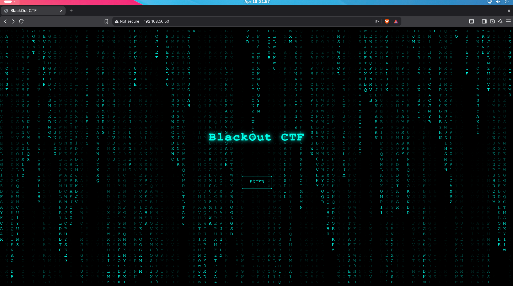
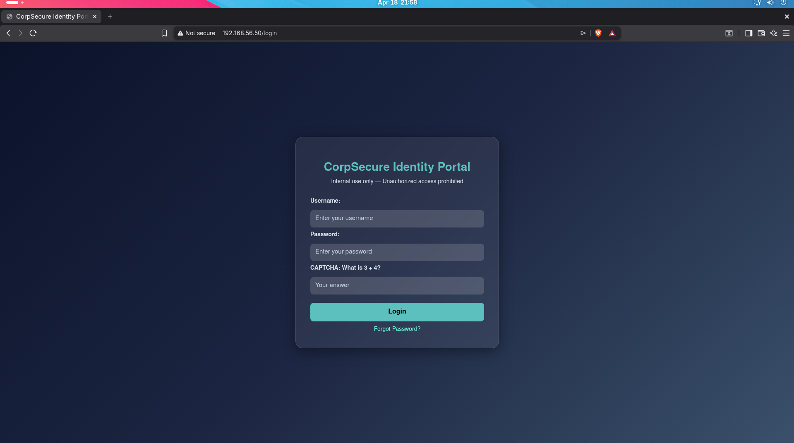
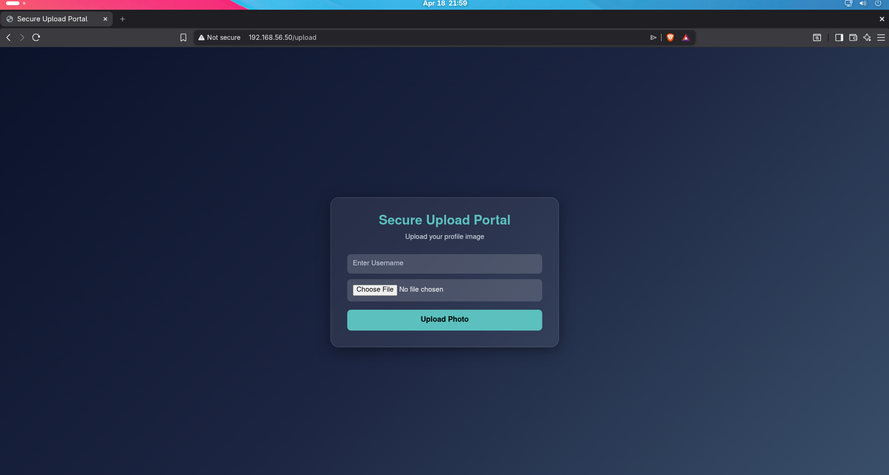
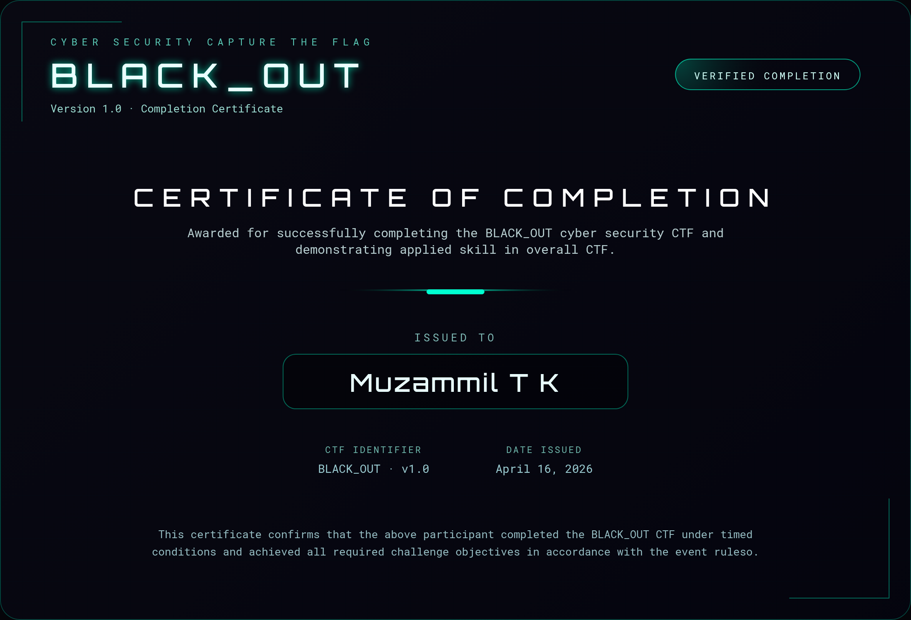

# BLACK_OUT CTF (v1.0)

A medium-difficulty Capture The Flag machine focused on real-world attack paths including web exploitation and Linux privilege escalation.

---

Machine Overview

| Field        | Value |
|-------------|------|
| Name        | BLACK_OUT |
| Difficulty  | Medium |
| Category    | Web → Linux → Privilege Escalation |
| OS          | Ubuntu-based |
| IP Address  | 192.168.56.50 |
---

##  Attack chain

Web Exploitation → SSH Access → Cron Abuse → Root

### Includes:
- SQL Injection
- IDOR
- File Upload Bypass
- SSH Key Extraction
- Python Cron Abuse (ACL misconfiguration)
- PATH Hijacking via root cron

---

##  Skills Required

- Basic web exploitation
- Linux enumeration
- Cron job analysis
- Privilege escalation techniques

---

##  Download

 See download link in /download/download_link.txt

---

##  Screenshots

###  Homepage

###  Login Page

###  Upload

###  Certificate

##  Disclaimer

This machine is created for **educational purposes only**.  
Do not use these techniques on systems without proper authorization.
---

## Author

Muzammil T K

---

If you enjoyed this machine, consider starring the repo!**.
